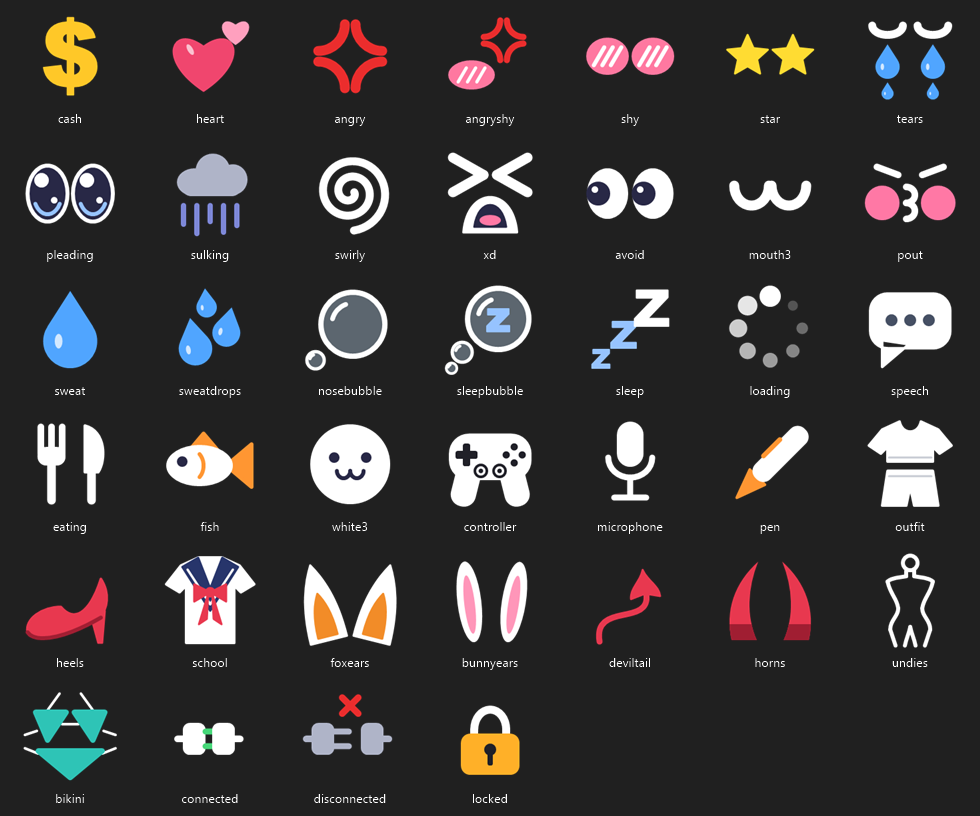

# LoupixDeck VTube Studio plugin

Plugin for [LoupixDeck](https://github.com/RadiatorTwo/LoupixDeck) that controls [VTube Studio](https://denchisoft.com/) through its plugin API: toggle expressions, trigger hotkeys of the model and of Live2D items, and see on the buttons what is on.

## Requirements

- VTube Studio with **Allow Plugin API access** switched on in its settings.
- LoupixDeck 1.37.0 or newer.

## Setup

1. Install the plugin in LoupixDeck and enable it for your device.
2. Open the plugin settings and press **Authorise**.
3. Click **Allow** in the popup in VTube Studio.

The token is stored in the plugin's settings, so the popup appears only once. **Forget token** removes it.

**Host** (default `localhost`) and **Port** (default `8001`) only need changing if VTube Studio runs elsewhere or on another port. The plugin reconnects on its own when VTube Studio starts later.

## Commands

| Command | What it does |
|---|---|
| `VTubeStudio.ConnectionStatus` | Shows `connected`, `not authorised` or `offline`. Pressing it while not authorised asks VTube Studio for access. |
| `VTubeStudio.ToggleExpression(<expression>[,<icon>])` | Toggles an expression of the model. |
| `VTubeStudio.ActivateExpression(<expression>)` | Switches an expression on. |
| `VTubeStudio.DeactivateExpression(<expression>)` | Switches an expression off. |
| `VTubeStudio.TriggerHotkey(<hotkey>[,<icon>])` | Triggers a hotkey of the model. |
| `VTubeStudio.TriggerItemHotkey(<item>,<hotkey>[,<icon>])` | Triggers a hotkey of a Live2D item in the scene. |

- `<expression>` is the expression's file name, with or without `.exp3.json`, or its name: `VTubeStudio.ToggleExpression(EXP_angry)`.
- `<hotkey>` is the hotkey's name or ID, or the file it uses (`sexy` finds the hotkey that toggles `sexy.exp3.json`): `VTubeStudio.TriggerHotkey(wave)`.
- `<item>` is the item's file name or a part of it: `VTubeStudio.TriggerItemHotkey(Clothes_Original,console)`.

Expressions of an item can only be switched through the item's hotkeys, so the item needs a hotkey for each of them in VTube Studio.

## What the buttons show

- Green: the expression is on. Black: off.
- Dimmed icon: VTube Studio is not running or not authorised.
- Dimmed icon with `?`: the loaded model has no such expression.

Hotkey buttons show on and off when the hotkey toggles an expression. For items, VTube Studio does not report the state, so the plugin counts the hotkey events instead and starts from "off" when it connects. An item expression that was already on then shows the wrong way round until it is toggled once in VTube Studio.

## Icons

A button gets its icon from keywords in the expression or hotkey name. Spaces, underscores and case do not matter, and the more specific keyword wins. The optional last parameter picks an icon by name, or `none` for text only: `VTubeStudio.ToggleExpression(EXP_angry,heart)`.



| Icon | Keywords |
|---|---|
| `cash` | cash, money, dollar |
| `heart` | heart, love |
| `angry` | angry, mad |
| `angryshy` | angryshy |
| `shy` | shy, blush |
| `star` | star, sparkle |
| `tears` | tears, cry |
| `pleading` | pleading |
| `sulking` | sulking |
| `swirly` | swirly, dizzy |
| `xd` | xd, dx |
| `avoid` | avoid |
| `mouth3` | 3mouth |
| `pout` | pout |
| `sweat` | sweat, cartoonsweat |
| `sweatdrops` | realisticsweat |
| `nosebubble` | nosebubble |
| `sleepbubble` | sleepbubble |
| `sleep` | sleep, zzz |
| `loading` | loading |
| `speech` | speech, talk |
| `eating` | eating, eat, food |
| `fish` | fish |
| `white3` | white3 |
| `controller` | console, controller, gamepad, gaming |
| `microphone` | microphone, mic |
| `pen` | pen, stylus, pencil |
| `outfit` | basicwhite, outfit, clothes |
| `heels` | sexy, heels |
| `school` | school, seifuku, uniform |
| `foxears` | kitsune, kittsune, fox, wolf |
| `bunnyears` | bunny, rabbit |
| `deviltail` | sdemon, succubus, tail |
| `horns` | demon, devil, horn |
| `undies` | naked, underwear, undies |
| `bikini` | bikini, swimsuit, swim |

`connected`, `disconnected` and `locked` belong to the connection button and have no keywords.

## Build

```
.\build.ps1
```

Builds the plugin and packs `dist\vtubestudio-<version>-any.zip`.
